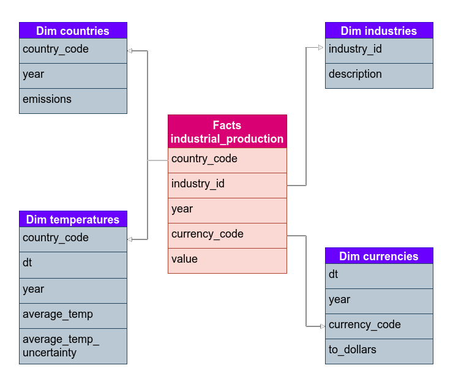

# Data Warehouse for Climate Change Analytics

This project was built as the Capstone project of Udacity's Data Engineering Nanodegree.

## Project Scope

The aim of the project is to build a **Data Warehouse** in Amazon Web Services to enable analytic insights about **Climate Change** and its relation with **Green House Gases** emissions and **Industrial Production**. The final schema available to users will iclude data from many different sources including: industrial production by country and year, a historical series of population and emissions by country and year that goes back to the XIX century and a historical series of earth temperature.

With this objective in mind, for most of the data it makes no sense to go to a deeper level of aggregation than by country and year. Only for temperature data will be included another level of granularity, by month, because doing the yearly average could hide some interesting insights. For example, maybe in some regions climate change is making weather more extreme, with colder winters and hotter summers, but the yearly average remains the same.

Finally, to get the insights a **Dashboard** tool like Tableau or Power BI could be connected to the database. This tools also have options to plot data in a map of the globe that could produce very neat reports. An example of a question that could drive one of these reports is: *which are the top industries (that produce more per capita) from the countries that have less polution per capita?*

## Data Sources

[Climate Change: Earth Surface Temperature Data](https://www.kaggle.com/berkeleyearth/climate-change-earth-surface-temperature-data)
[Annual CO2 emissions per country](https://ourworldindata.org/co2-and-other-greenhouse-gas-emissions#co2-in-the-atmosphere)
[Population by country](https://www.gapminder.org/data/documentation/gd003/)
[STAN Industrial Analysis](https://stats.oecd.org/Index.aspx?DataSetCode=STANI4_2016)
[Foreign Exchange Rates 2000-2019](https://www.kaggle.com/brunotly/foreign-exchange-rates-per-dollar-20002019)

### Climate Change: Earth Surface Temperature Data

From this dataser we will use *GlobalLandTemperaturesByCountry.csv* as explained in the project scope. Data comes from the Berkeley Earth Surface Temperature Study combines 1.6 billion temperature reports from 16 pre-existing archives.

Data goes from the year 1743 to the present, and includes:
- LandAverageTemperature: global average land temperature in celsius
- LandAverageTemperatureUncertainty: the 95% confidence interval around the average

### CO2 emissions

This dataset contains emission data of CO2 in tonnes of different countries from year 1751 - 2017. Data originally published by: *Le Quéré et al. (2018). Global Carbon Project; Carbon Dioxide Information Analysis Centre (CDIAC).*

### Population by country

This data comes from GapMinder, which had use different sources to gather population data from different periods. As explained in their bewsite, the different data sources are:

- 1650: McEvedy & Jones “McEvedy, Colin and Richard Jones, 1978,”Atlas of World Population History,” Facts on File, New York, pp. 342-351.” As cited by US census bureau

- 10.000 BC to – 1900 (except 1650): Biraben (except 1650 from McEvedy Jones) “Biraben, Jean-Noel, 1980, An Essay Concerning Mankind’s Evolution, Population, Selected Papers, December, table 2. As cited in US census bureau”

- 1800 to 1949: We use Maddison population data improved by CLIO INFRA in April 2015 and Gapminder v3  documented in greater detail by Mattias Lindgren. The main source of v3 was Angus Maddison’s data which is maintained and improved by CLIO Infra Project. The updated Maddison data  by CLIO INFRA were based on the following improvements: i. Whenever estimates by Maddison were available, his figures are being followed in favor of estimates by Gapminder; ii. For Africa, estimates by Frankema and Jerven (2014) for the period 1850-1960 have been added to the existing database; – For Latin America, estimates by Abad & Van Zanden (2014) for the period 1500-1940 have been added.

- 1950-2100: We use UN POP from their [World Population Prospects 2019](https://population.un.org/wpp) published in the file with annually interpolated demographic indicators, called WPP2019_INT_F01_ANNUAL_DEMOGRAPHIC_INDICATORS.xlsx, accessed on October 14, 2019.

### STAN Industrial Analysis

The STAN database for industrial analysis provides analysts and researchers with a comprehensive tool for analysing industrial performance at a relatively detailed level of activity across countries. The selected dataset includes data of the monetary value produced by different industries at an aggregation level of country and year.

This dataset will be the main source for our facts table and hopefully will provide new insights about wich countries have greener industries, which could lay the foundation of a further study about how to redesign our countries for the future.

### Foreign exchange rates

A dataset generated on the Federal Reserve's Download Data Program, with some changes. This table had to be preprocessed before the copy statement because there isn't a good implementation of unpivot tables in Redshift.

## Data Warehouse design

The Data Warehouse will follow a **Kimball's Bus Architecture** with a **Redshift** database in **2nd Normal Form** for users and analytics applications with the following **Star Schema**:

There will be X staging tables that will ingest data with few transformations from the sources.

An etl on *etl.py* will load the data into the staging tables, transform and insert it on the final tables.

## Further discussion

This initial project of a Data Warehouse could evolve in many different directions and some of these directions would require of structural changes and/or incorporation of new tools. In this sections we'll discuss some situations that could arise in the future and how to deal with them.

### The data was increased by 100x

It may happen that...
In this case we could transform the Data Warehouse into a Data Lake and use Spark to process data. Staging tables should be more refined.

### The pipelines would be run on a daily basis by 7 am every day

It may happen that...
The optimal solution would be to create a Pipeline in airflow...´
Some data scrapper would also be needed... in the case of exchange rates data could be get from the [Federal Reserve](https://www.federalreserve.gov/releases/h10/Hist/default.htm), whose data is updated weekely.

### The database needed to be accessed by 100+ people

???